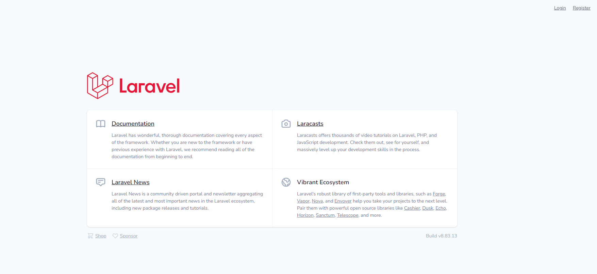
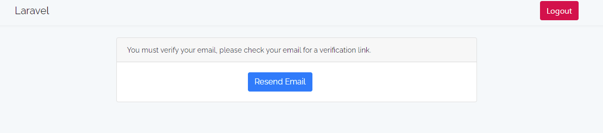

# # Using Fortify Package

** A fortify package using demo project **




## # Test mail sent
**Test sent your mail then create <b style="color:orange">mailtrap</b> account goto link => [`Mailtrap`](https://mailtrap.io/):**
Add this come for .env file customize for:

```php
MAIL_MAILER=smtp
MAIL_HOST=smtp.mailtrap.io
MAIL_PORT=2525
MAIL_USERNAME=1d427c59037432
MAIL_PASSWORD=d1fa90f72ebb35
MAIL_ENCRYPTION=tls
```
**To**
```php
MAIL_MAILER=smtp
MAIL_HOST=smtp.mailtrap.io
MAIL_PORT=2525
MAIL_USERNAME=1d427c59037432
MAIL_PASSWORD=d1fa90f72ebb35
MAIL_ENCRYPTION=tls
MAIL_FROM_ADDRESS='noreply@test.com'
```


## Installation

Install [`Fortyfy Project`](https://www.fortify.rahridoy.com) with php artisan:

```php
Composer update

Add .env file

php artisan serve
```
## # Create database
```php
php artisan migrate
```

## # Create Seeder
**To get started, `seeder` file add:**

```php
php artisan migrate:fresh --seed
```

## # Can't sent mail



## # Can reset Password


## # Can Two factor add


Copyright © All rights reserved by [**rahridoy.com**](https://jahidulislamzim.com/)